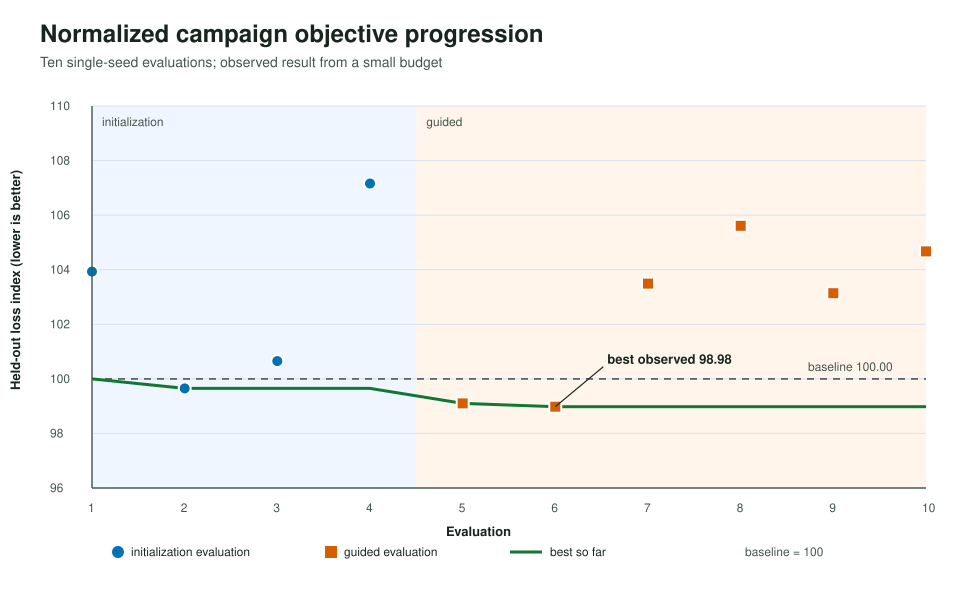
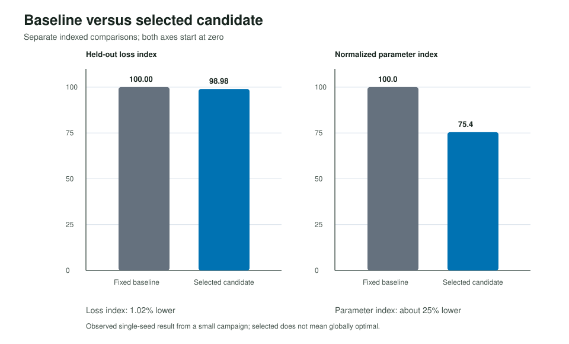

# Anonymized GPT training campaign

This case study shows Looptimum coordinating an expensive model-training loop
through four bounded recipe controls: learning rate, microbatch size, gradient
accumulation, and model depth. The evaluator remained client-owned; Looptimum
only proposed candidates and recorded the resulting scalar observations.

## Lifecycle

The integration kept a narrow contract:

1. Looptimum suggested one bounded recipe.
2. An external evaluator trained and measured that candidate.
3. The evaluator returned one locked held-out loss index for ingestion.

The file-backed observation history made the campaign resumable and left an
auditable record of which candidates had been evaluated.

## Campaign design

The small campaign comprised four deterministic initialization evaluations and
six guided evaluations. All ten evaluations completed successfully. Lower
held-out loss index is better, and the fixed baseline is normalized to
`100.00`.

## Observed result

| Result | Observed value |
| --- | ---: |
| Locked held-out loss | `1.02%` lower than the fixed baseline |
| Model parameters | Approximately `25%` fewer than the fixed baseline |
| Evaluations | `10/10` successful |

These are single-seed, small-budget observations. They do not establish
statistical significance or global optimality.

## Optimization trajectory



The four initialization evaluations established bounded coverage. The guided
phase then produced the two strongest observed candidates, ending with a
best-so-far loss index of `98.98`. The remaining guided evaluations explored
other parts of the bounded space without improving that observed result.

## Baseline versus selected candidate



The paired view keeps two distinct findings separate: the selected candidate
had a modest `1.02%` lower held-out loss index and used about `25%` fewer model
parameters. Fewer parameters are not presented as a direct claim about runtime
or operating cost.

## What this demonstrates

This example demonstrates bounded, resumable, and auditable guided trial
targeting for a costly external evaluation loop. It shows that Looptimum can
coordinate a training-recipe campaign without taking ownership of the training
environment or embedding application-specific evaluation logic in the
controller.

## Limitations

- This was a single-seed campaign with a small evaluation budget.
- The selected candidate is the best observed candidate, not a proven global
  optimum.
- The result does not establish statistical significance, causal effects from
  any one control, transfer to another workflow, or production readiness.
- A normalized held-out loss index should not be interpreted as a broader
  measure that the campaign did not evaluate.

## Generic integration sketch

```text
bounded control space
        |
        v
Looptimum suggest -> client-owned training evaluator
        ^                         |
        |                         v
        +-------- ingest one held-out loss index
```

The evaluator contract needs a candidate identifier, bounded recipe controls,
terminal status, and one finite scalar objective. See the public
[Looptimum overview](../../../README.md) and [pilot scope](../../../PILOT.md)
for integration guidance.

## Reproducing the public figures

The figures are generated only from the normalized files in this directory:

```bash
python docs/examples/gpt_training_campaign/generate_assets.py
PYTHONDONTWRITEBYTECODE=1 python -m unittest discover \
  -s docs/examples/gpt_training_campaign/tests \
  -p 'test*.py' -v
```

The generator uses only the Python standard library and emits deterministic
SVG bytes.
