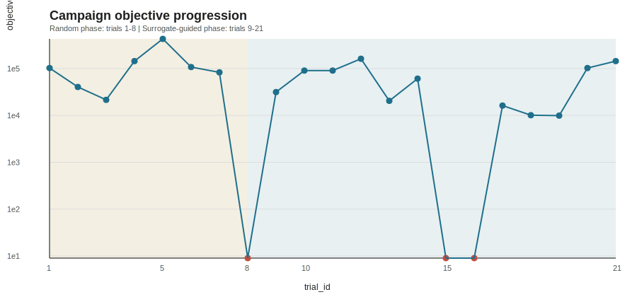
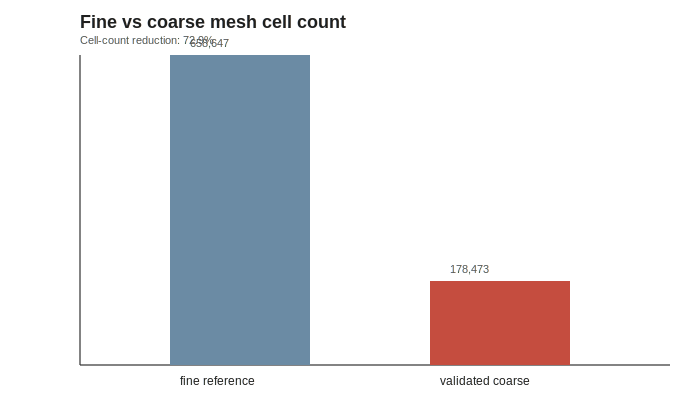
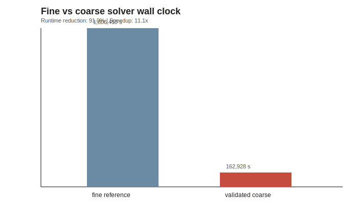
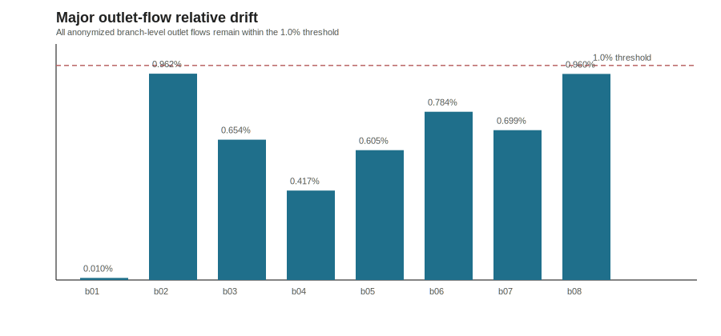
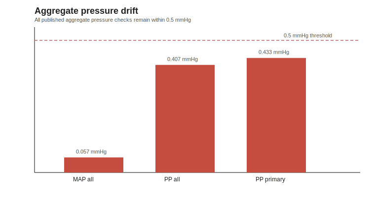

# Case Study: Validated Coarse-Mesh Candidate From Campaign

This sanitized case study shows a bounded Looptimum campaign wrapped around an
external `snappyHexMesh` workflow, followed by post-hoc solver validation
against a fine reference solve.

## Summary

- campaign budget explored `21` unique trials across a bounded `216`-point
  search space
- the first `8` trials were random; the next `13` were surrogate-guided
- the selected public case is campaign trial `15`
- archived objective loss for trial `15`: `9.0`
- selected coarse candidate cells: `178473`
- fine reference mesh cells: `658647`
- cell-count reduction: `72.9%`
- fine reference solver wall clock: `1.80645e+06 s`
- selected coarse solver wall clock: `162928 s`
- solver wall-clock reduction: `91.0%`
- solver speedup: `11.1x`
- all major outlet flows stayed within `1%`
- aggregate MAP and PP stayed within `0.5 mmHg`

The selected candidate still recorded `1` failed archived `checkMesh` check.
It was accepted because the downstream solver run reached the target end time
and the fine-versus-coarse solution drift stayed within the stated acceptance
thresholds.

## Optimization Phase

The campaign searched five bounded mesh controls:

- `castellatedMeshControls.nCellsBetweenLevels`
- `refinementSurfaces.pipe_level_mode`
- `refinementRegions.distance_mode`
- `snapControls.nSmoothPatch`
- `snapControls.tolerance_mode`

Archived optimization outcomes:

- search-space coverage: `9.7%`
- median loss improved from `92,720.9` in the random phase to `31,508.5` in
  the surrogate phase
- mean loss improved from `116,069.6` to `56,775.6`
- hit rate for `loss <= 20,000` improved from `1/8` to `5/13`
- the campaign found a repeatable low-loss basin, not a single isolated point

## Selected Validated Case

The public selected case is trial `15`.

Archived mesh-quality snapshot for that trial:

- objective loss: `9.0`
- total cells: `178473`
- severe non-orthogonal faces (`> 70 degrees`): `2`
- warped faces: `4`
- low-weight faces: `0`
- underdetermined cells: `0`
- failed `checkMesh` checks: `1`

Reference fine-mesh snapshot:

- total cells: `658647`
- severe non-orthogonal faces (`> 70 degrees`): `28`
- `Mesh OK.`
- fine reference solver wall clock from the original run log:
  `1.80645e+06 s`

Selected coarse solver snapshot:

- selected coarse solver wall clock from the solver log: `162928 s`
- wall-clock reduction versus fine reference: `90.98%`
- speedup versus fine reference: `11.09x`

## Post-Hoc Validation

Validation thresholds used for the public case:

- all major outlet flows within `1%`
- aggregate MAP within `0.5 mmHg`
- aggregate PP within `0.5 mmHg`
- no clinically or materially meaningful deviation

Observed comparison versus the fine reference:

- max major outlet-flow relative drift: `0.9617%`
- aggregate MAP drift: `-0.0570 mmHg`
- aggregate PP drift: `-0.4070 mmHg`
- selected primary-branch PP drift: `-0.4333 mmHg`
- post-hoc solver reached `4.999946 s` against a `5.0 s` target
- the selected coarse case preserved the target behavior while cutting solver
  wall clock by `91.0%`

All published public acceptance checks pass.

## Why Trial 15 Was Accepted

Trial `15` is the selected public example because it closed the loop:

- it was one of the tied-best archived objective candidates
- it produced a functional coarse solver case
- it preserved the fine-reference pressure and flow behavior within the stated
  thresholds
- it unlocked the next phase of the experiment, which is the practical exit
  criterion that mattered

The presence of one archived failed `checkMesh` check is documented rather than
hidden. In this case, downstream solver success and mesh-independence evidence
were the decisive acceptance criteria.

## Included Artifacts

- `campaign/observations.csv`
- `campaign/acquisition_log.jsonl`
- `campaign/bo_state.json`
- `campaign/trials/`
- `campaign/c06_config_record.md`
- `validation/solver_pass_summary.json`
- `validation/reference_mesh_check_summary.json`
- `validation/selected_mesh_check_summary.json`
- `validation/major_metric_comparison.csv`
- `validation/plots/`
